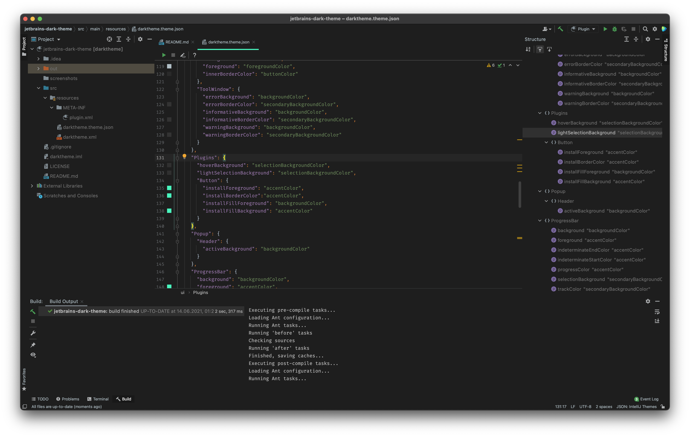

# jetbrains-dark-theme

It's just a dark theme for JetBrains IDEs with the Darcula syntax highlighting.

### Requirements

- Installed [Fira Code](https://github.com/tonsky/FiraCode) in IDE

### Installation

1. Download a jar file from [the releases page](https://github.com/lxbrvr/jetbrains-dark-theme/releases)
2. Open IDE
3. Go to `Preferences -> Plugins`
4. Click `Install Plugin from Disk...`
5. Choose the downloaded jar file

The theme created using https://plugins.jetbrains.com/docs/intellij/themes.html